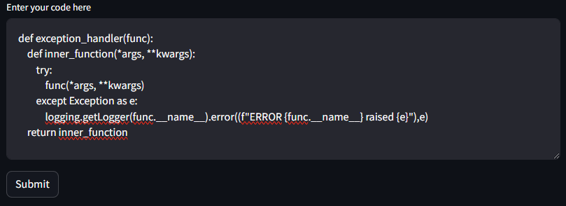
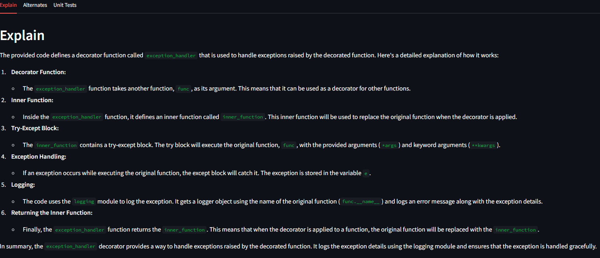
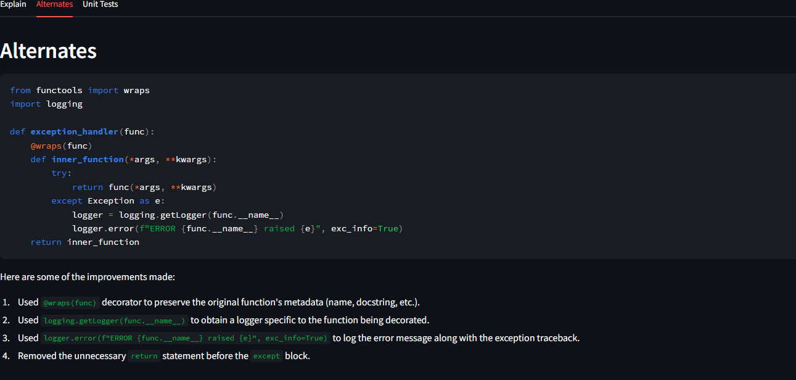
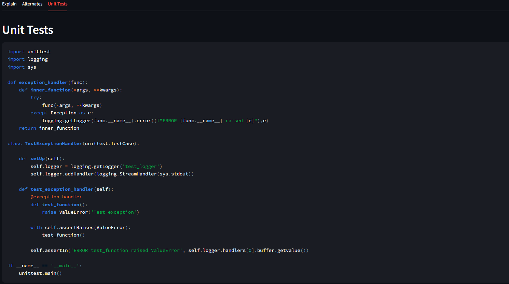

# langchain-vertexai-gemini-codeadvisor

A small project to demonstarte usage of LangChain with Google Cloud's VertexAI and Gemini LLM.

This is a streamlit application, which takes a code/function as an input and the application provides descrption of the given code, alternate forms of rewriting the code and finally some unit test cases.

## Prerequisites
- Google Cloud Account with Vertex AI API enabled 
    - for running locally - ensure your local auth is done/setup; https://cloud.google.com/sdk/gcloud/reference/auth
    - for running on gcp (cloudrun or gke or computeengine) - ensure the account (serviceaccount) has permissions for VertexAI
- Python 3
    - The required dependencies are in the requirements.txt
- LangChain
    - Check out https://python.langchain.com/docs/integrations/llms/google_vertex_ai_palm

## Installation
1. Clone the repository.
2. Create a python venv https://docs.python.org/3/library/venv.html 
3. Install dependencies
    > pip install -r requirements.txt
4. Start the streamlit app, should open a brower window; if not open manually (the output of below command provides the url)
    > streamlit run main.py

## How it works
It is wonderful to see how frameworks like LangChain make it easier to work with LLMs, they provide a simplified api which allows to interact with LLMs. Refer to the LangChain docs for more information.

**Create an instance of LLM, in this case GCP's VertexAI's gemini-pro**
> from langchain.llms import VertexAI
> llm = VertexAI(model_name="gemini-pro", max_output_tokens=1024)

**Create prompt templates**
> prompt_explain = PromptTemplate.from_template("Explain what the below code does. {entered_code}")

> prompt_alternate = PromptTemplate.from_template("Can you rewrite the below function using python best practices? {entered_code}")

> prompt_unittests = PromptTemplate.from_template("Create unit test code/cases for the below function. {entered_code}")

**Execute the query against the Gemini-pro LLM**
- Get the entered code
> entered_code = st.text_area(label="Enter your code here", height=200)

- Execute query, by providing the code to prompt template and invoking LLM
> codeExplanation=llm(prompt_explain.format(entered_code=entered_code))

**Refer to the code in**
> main.py

## Usage
1. Enter a python code/function in the given textarea and press submit
2. Look for Tabs "Explain", "Alternate", "Unit Tests"

## Screen shots of an example usage I tested with

### Input

### Output Explain

### Output Rewrite suggestion

### Output Unit Tests 
